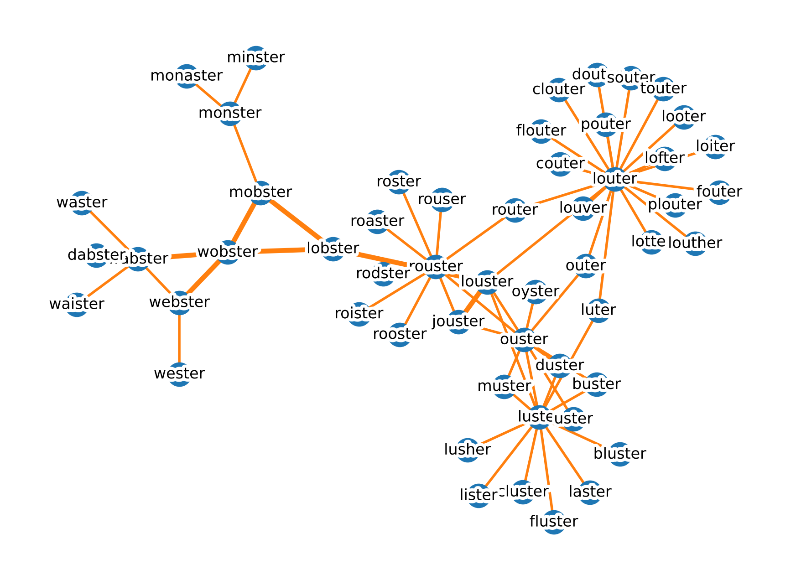

# Word Network Graph
Visualization of similar English words as measured by edit distance

2023-01-23

## Example output

## Interactive Visualization

https://pjleimbigler.github.io/wordgraph/graph.html

## What does this code do?

Given an English word:
1. Find other words with a [Levenshtein distance](https://en.wikipedia.org/wiki/Levenshtein_distance) of exactly 1, recursively out to a desired depth
2. Visualize the resulting network graph of words as a static image
3. Write the network node and link data to a file for interactive visualization with [react-force-graph](https://github.com/vasturiano/3d-force-graph)
